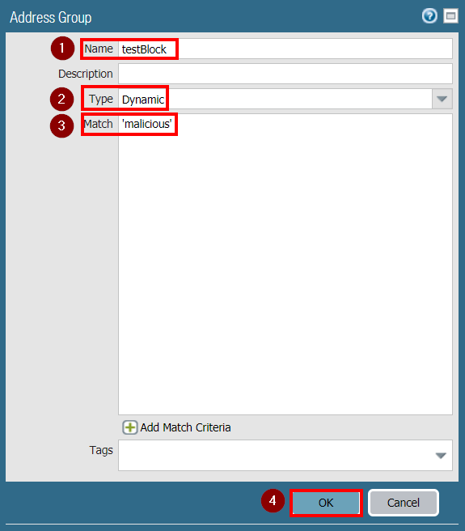
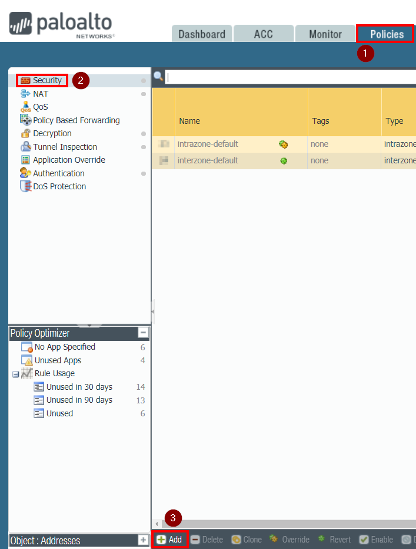
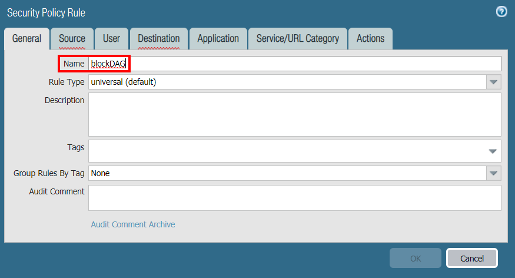
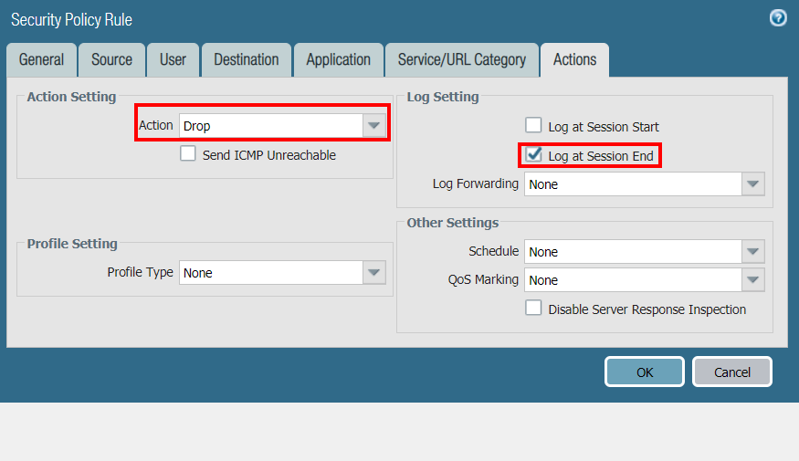
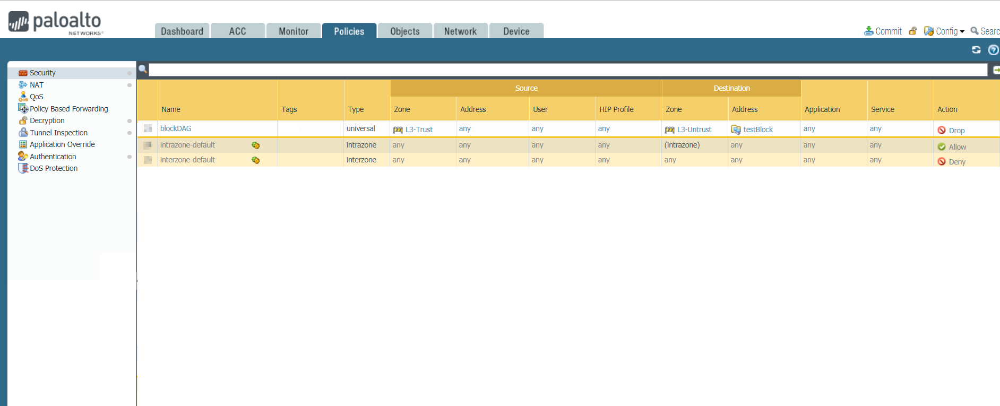
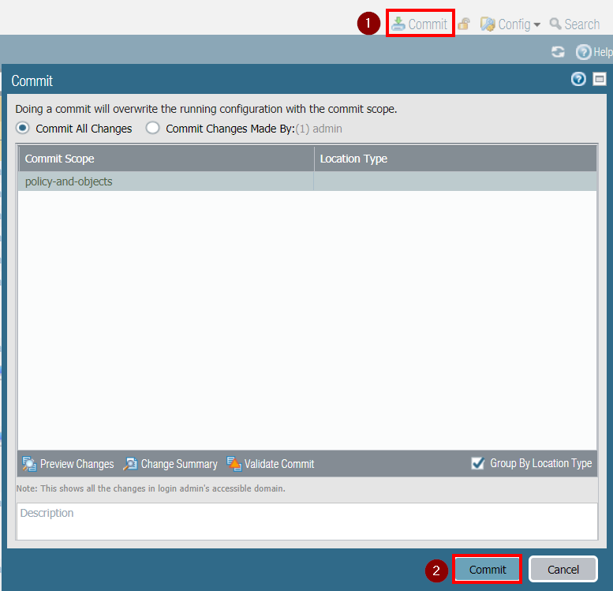

# PAN Client

# Configuration

## Step 1: Create Two Dynamic Address Groups

1. Log in to the Next-Generation Firewall with administrative credentials.
2. Navigate to **Objects > Address Groups**, then click on **Add**:  
   
3. Enter the **Name** (e.g., `testBlock`), and select **Dynamic** as the **Type**.  
   In the **Match** window, type `'Block_Host'` or whatever you defined in `pan_config.py` (the example image uses `'malicious'`). Note the single quotes. This is the name of the tag you will use for matching. Every IP tagged with this tag will automatically be added to this Dynamic Address Group.  
   
4. Create a second Dynamic Address Group for destination IP-based blocking, using the tag `'Block_Detection'` or whatever you defined in `pan_config.py`.

---

## Step 2: Create a Security Policy

As mentioned earlier, the way you create a Security Policy will determine how the firewall behaves. The policy created in this example will block all outbound traffic from any IP tagged with `'Host_Block'`.  

**Policy Parameters:**

- **Source**: `testBlock` Dynamic Address Group (the IPs tagged as `'Block_Host'`)
- **Destination**: Any
- **Application**: Any
- **Service**: Any
- **Action**: Block

### Steps to Create a Security Policy:

1. Navigate to **Policies > Security**, then click on **Add**:  
   
2. Enter the parameters as follows:
   - In the **General** tab, enter the policy **Name** (e.g., `blockDAG`).  
     
   - In the **Source** tab, add the `testBlock` DAG as the **Source Address**.
   - In the **Destination** tab, select **Any**.
   - In the **Service/URL Category** tab, select **Any** as the **Service**.
   - In the **Actions** tab, select **Drop** as the **Action**, and enable the **Log at Session End** checkbox.  
     
3. Click **OK**, and verify the newly created policy:  
   

If you also want to use destination IP-based blocking alongside source host IP-based blocking, create a second policy. In this policy, the logic is inverse:  
- **Source**: Any trusted zones (e.g., internal IPs)
- **Destination**: The DAG group created for any IP tagged as `'Block_Detection'`.

---

## Step 3: Commit the Configuration

Now that the DAGs and policies have been created, commit the configuration:  

The firewall configuration is now complete! No further commits are required for the IP registration process.

---

## Step 4: Vectra Automated Response Configuration

In the `pan_config.py` file, fill in the following three variables:

- `INTERNAL_BLOCK_TAG = "Block_Host"`: Name of the tag you choose for host-based blocking (source IP-based blocking).
- `EXTERNAL_BLOCK_TAG = "Block_Detection"`: Name of the tag you choose for detection-based blocking (destination IP-based blocking).
- `URLS = ["https://<IP or hostname>"]`: List of URLs for all PAN firewalls you wish to integrate into this automation.

---

## Step 5: API Keys

The PAN API authentication relies on an API Key derived from your credentials (username, password, and a firewall master key).

Since PAN-OS does not support creating API keys from the GUI, the first execution of the script will prompt you for your username and password. Provide administrative credentials for each configured firewall. The script will then query the PAN-OS API to generate an API token for that user and store it securely for subsequent script executions.

---

## Revoking API Keys

You can revoke all currently valid API keys if any are compromised. To change an API key associated with an administrator account:  
1. Change the password of the administrator account.  
2. All API keys generated before this change or using the previous credentials will no longer be valid.
